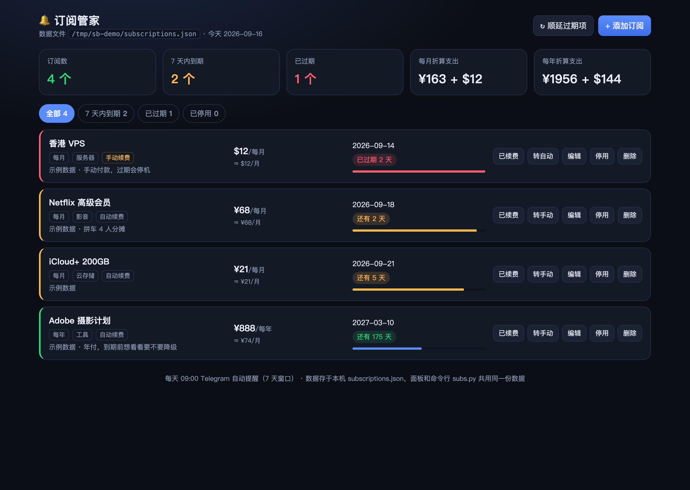
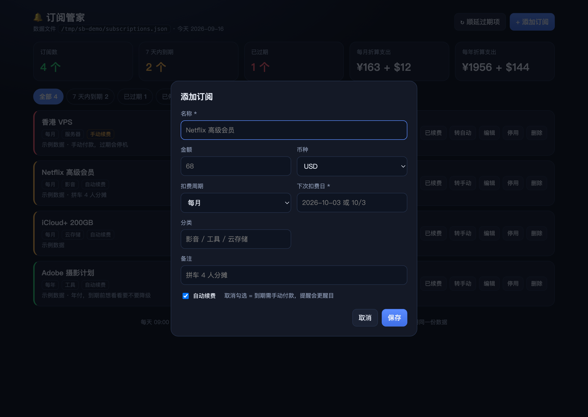

# 订阅管家 · subs-butler

> 本地订阅 / 会员续费管理器：**CLI + 网页面板 + 到期提醒**，一个数据文件，零依赖，不联网。

`subs.py` 管数据，`panel.py` 给一个能看能改的本地网页（手机也能开），
配个定时任务就能在到期前推提醒给你 —— 再也不会被"自动续费"默默扣钱。

```
🔔 订阅续费提醒 —— 1 个已到期!

⚠️ 香港 VPS  $12/每月  下次扣费 2026-09-14 (已过期 1 天 · 需手动续费)
     ↳ 不续的话记得去取消/降级
🟡 Netflix 高级会员  ¥68/每月  下次扣费 2026-09-18 (还有 3 天 · 自动续费)

合计待扣: ¥89 + $12
```



## 特性

- **零依赖**：纯 Python 标准库，Python 3.8+ 直接跑，数据就是个 JSON 文件
- **不联网**：数据只在本机，面板只监听 127.0.0.1（要手机访问才开局域网 + 令牌保护）
- **周期都支持**：每周 / 每两周 / 每月 / 每季 / 每半年 / 每年 / 自定义天数
- **多币种**：人民币、美元、港币… 合计分开算，金额可留空（只想被提醒不想记账）
- **月末不漂移**：每月 31 号扣费的，2 月落到 28/29，3 月回到 31（`anchor_day`）
- **续费顺延**：`renew` 自动推进一个周期；漏了几期会自动追到未来；留 `history` 记录
- **静默提醒**：`check` 没到期就零输出 —— 定时任务只在有东西要续时打扰你
- **Web 面板**：卡片式看板、周期进度条、按状态筛选、增删改一键续费
- **手机可用**：同一个 Wi-Fi 扫码即开，支持"添加到主屏幕"；外出可用 Cloudflare Tunnel
- **63 个单元测试**：含真起 HTTP 服务验证令牌/权限行为（`python3 -m unittest discover -s tests`）

## 快速开始

```bash
git clone https://github.com/gty198/subs-butler.git
cd subs-butler

# 1) 加订阅
python3 subs.py add -n "Netflix 高级会员" -a 68 -c monthly --next-due 2026-09-18 --category 影音
python3 subs.py add -n "ChatGPT Plus" -a 20 -c monthly --next-due 9/17 --no-auto-renew
python3 subs.py list

# 2) 打开面板（自动开浏览器）
python3 panel.py
#    http://127.0.0.1:8899/

# 3) 配每日提醒（见下一节）
python3 subs.py check -d 7          # 有到期才输出，没到期什么都不打印
```

## CLI 命令

| 命令 | 作用 |
|---|---|
| `python3 subs.py list [--all]` | 列出全部订阅（`--all` 含已停用），按到期日排序 |
| `python3 subs.py due [-d 7]` | 看未来 N 天内到期 + 已过期的（默认 7 天） |
| `python3 subs.py check [-d 7]` | 同 `due`，但**没到期的什么都不输出**，专给定时任务用 |
| `python3 subs.py add -n 名称 -a 金额 -c 周期 --next-due 日期` | 新增订阅 |
| `python3 subs.py renew <id\|名称> [--date 日期]` | 标记已续费，自动顺延周期 |
| `python3 subs.py roll` | 把所有"已过期且自动扣费"的顺延到未来 |
| `python3 subs.py edit <id\|名称> [-a 金额] [--next-due 日期] [--inactive]` | 改字段 / 停用 |
| `python3 subs.py remove <id\|名称>` | 删除 |
| `python3 subs.py ids` | 只打印 id，方便脚本消费 |
| `python3 subs.py reset --yes` | 清空 |

公共选项：`--file 路径` 换个数据文件（默认同目录 `subscriptions.json`）。

```bash
# 周期: weekly | biweekly | monthly | quarterly | semiannual | yearly | custom_days
python3 subs.py add -n "域名" -a 60 -c custom_days --cycle-days 45 --next-due 2026-10-01
python3 subs.py add -n "VPS" -a 12 -c monthly --next-due 2026-10-14 --currency USD
python3 subs.py add -n "年付会员" -a 888 -c yearly --next-due 2027-03-10

# 日期写法很宽松: 2026-09-18 / 2026/9/18 / 9/18（没写年份且已过去 → 自动算明年）
python3 subs.py add -n "松日期" -a 9 -c monthly --next-due 9/18
```

## 到期提醒（核心）

`subs.py check` 就是"有到期才说话"的：没到期时零输出，所以怎么接通知都不会骚扰你。

**Linux / macOS crontab**（每天 9 点检查 7 天窗口）

```cron
0 9 * * * /usr/bin/python3 $HOME/subs-butler/subs.py check -d 7 | /usr/bin/mail -s "订阅续费提醒" you@example.com
```

仓库里给了个更完整的例子：`examples/reminder-cron.sh`（macOS 通知中心弹窗 + Telegram Bot 推送，二选一或都用）。

**用 Hermes Agent 的话**，直接让 Agent 建个 cron 任务跑 `check`，
把 stdout 原样投递到聊天窗口就是"有到期才响"的提醒（本项目就是这么自用的）。

**接 Telegram Bot**（不想装任何东西）

```bash
OUT=$(python3 subs.py check -d 7)
[ -n "$OUT" ] && curl -s -X POST \
  "https://api.telegram.org/bot$TG_BOT_TOKEN/sendMessage" \
  -d chat_id="$TG_CHAT_ID" --data-urlencode text="$OUT"
```

## 网页面板

```bash
python3 panel.py                        # http://127.0.0.1:8899/（端口被占自动往后找）
python3 panel.py --file examples.json   # 拿示例数据试玩
python3 panel.py --host 0.0.0.0         # 开手机访问（自动生成令牌 + 二维码）
```

- 看板：订阅数 / 7 天内到期 / 已过期 / **每月·每年折算支出**（周付、年付都会折算成月）
- 每条订阅：金额、周期、下次扣费、剩余天数标签、**周期进度条**、自动/手动续费
- 操作：添加（表单）、编辑、**已续费**（自动顺延）、转手动/转自动、停用、删除、一键顺延过期项
- 快捷键：`n` 新增，`r` 刷新，`Esc` 关弹窗；`/#add` 直接弹出新增表单
- 只监听 `127.0.0.1`，数据不出本机



## 手机上用

### 同一个 Wi-Fi（最快）

```bash
python3 panel.py --host 0.0.0.0        # macOS 也可双击 panel-phone.command
```

启动后会打印手机地址并生成二维码 `phone-access.png`：

```
📱 手机访问 (连着同一个 Wi-Fi 直接开):
   http://192.168.1.23:8899/?t=xxxxxxxx
   备用(路由器换了 IP 也能用): http://your-mac.local:8899/?t=xxxxxxxx
   二维码: phone-access.png   ← 手机相机扫一下直接打开
```

- 手机扫码 / 敲地址打开一次，之后这台设备记住令牌（cookie 30 天），直接开 `http://192.168.1.23:8899/` 就行
- Safari「分享 → 添加到主屏幕」= 桌面上多个 App 图标（已内置图标、全屏 meta）
- 令牌存在 `.panel_token`（权限 600）**重启不变**，所以二维码长期有效；换令牌：删掉该文件重启，或 `--token 新值`
- 开了局域网就**自动启用令牌校验**：没带令牌的请求一律 401，写操作也拒掉
- 加 `--no-token` 可关闭校验（**仅限完全可信的网络**）

### 出门在外

```bash
cloudflared tunnel --url http://127.0.0.1:8899     # 给你一个公网 https 地址
```

面板自带令牌保护，公网访问也需要 `?t=`；**别把带令牌的链接发给别人**。电脑关机/睡眠时不可用。

## 数据格式

数据就是一份 JSON（默认 `subscriptions.json`，与脚本同目录）：

```json
{
  "subscriptions": [
    {
      "id": "netflix",                  // 唯一标识，可省略自动生成
      "name": "Netflix 高级会员",
      "amount": 68.0,                   // 金额，可 null（只提醒不记账）
      "currency": "USD",                // 默认 USD，可写 CNY / HKD / JPY ...
      "cycle": "monthly",               // 见上表；custom_days 时配合 cycle_days
      "cycle_days": null,
      "next_due": "2026-09-18",         // 下次扣费日
      "auto_renew": true,               // false = 需手动续费，提醒会更醒目
      "category": "影音",
      "notes": "拼车 4 人分摊",
      "active": true,                   // false = 停用，数据保留但不提醒
      "anchor_day": 18,                 // 每月固定几号，续费顺延时保持不漂移
      "history": []                     // renew 时自动追加
    }
  ]
}
```

默认币种想改别的：编辑 `subs.py` 里的 `DEFAULT_CURRENCY`，
或临时 `SUBS_DEFAULT_CURRENCY=CNY python3 subs.py add ...`。

## 测试

```bash
python3 -m unittest discover -s tests -t .        # 63 个用例，约 4 秒
python3 -m unittest tests.test_panel -v           # 只跑面板/HTTP 那批
```

覆盖：日期宽松解析与月末钳制、各周期推进、多币种汇总、续费/顺延/追踪历史、
提醒窗口边界（第 7 天进、第 8 天不进、过期必报）、面板动作层校验、
图标 PNG 字节校验、局域网 IP 过滤（排除 VPN 假地址段），
以及**真起一个 HTTP 服务**验证令牌 401 / 下发 cookie / 写操作权限 / 公开图标。

## 兼容性

- Python **3.8+**（已在 3.9.6 和 3.14.3 上各跑通全部测试）
- macOS / Linux / Windows（`.command` 双击启动是 macOS 的；手机访问用到的
  `route`、`ipconfig`、`scutil` 也只在 macOS 生效，其他系统会走通用兜底，取不到就只打印本机地址）

## 常见问题

**Q：会不会把订阅数据传到哪儿去？**
不会。没有网络请求，唯一对外的是你自己启动的本地 HTTP 服务（默认只听 127.0.0.1）。

**Q：`check` 明明有到期的却没输出？**
看是不是那条订阅 `active: false`（停用），或者到期日还在窗口外（`-d` 调大试试），
或者脚本和数据文件的路径对不上（`--file` 指定一下）。

**Q：开了手机访问，局域网里别人能改我数据吗？**
不带 `?t=令牌` 的请求一律 401；没访问过带令牌链接的设备也拿不到 cookie。
所以别把带令牌的链接发到群里。心里没底就把 `.panel_token` 删掉重启（所有旧链接立即失效）。

## License

MIT
